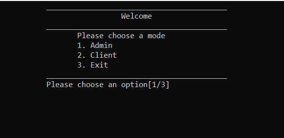
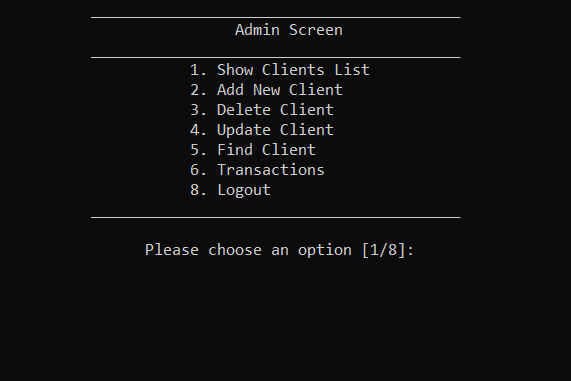
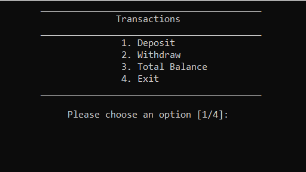
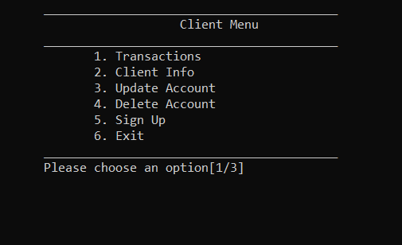

## Bank System
 # a c++ project that simulates a bank system using OOP principles

the project provides basic functionalities commonly found in a bank application, such as creating accounts, depositing and withdrawing funds, checking account balances.

#How to open the project
-download the file and all header files & text files should be defined by the project.
once you compiled the project you will this screen where you can choose a mode.

# Admin

<h5>hint: username and password are: Admin</h5>

Admin can access all features of project like
- View all clients
- View total balance
- Deleting
- Adding Client
- Updating Client
- Finding Client
- Making Transactions

in the transaction screen you can
- Deposit
- Withdraw
- View the total balance(only the Admin can acces it)

- 

# Client

Client have access to some features of the project

-
